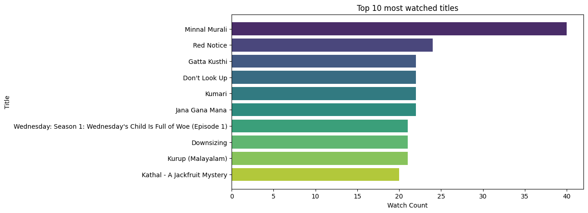
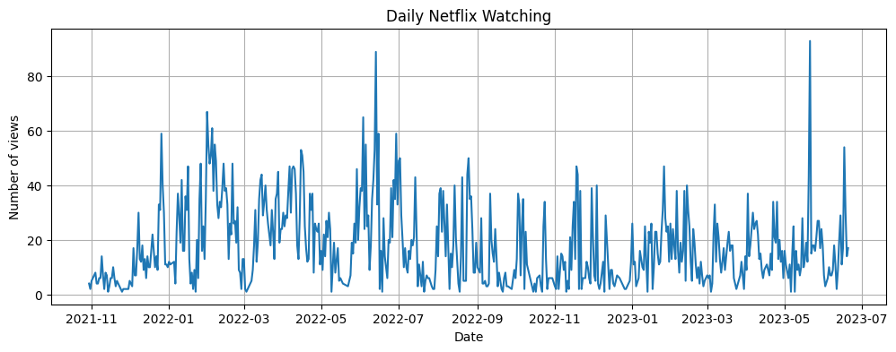
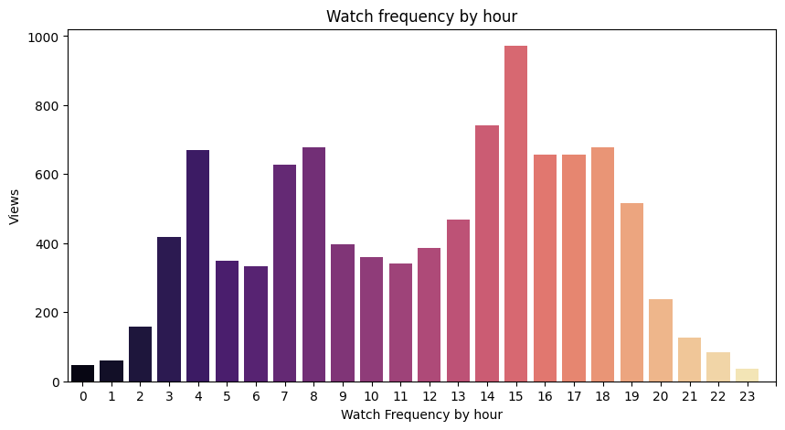
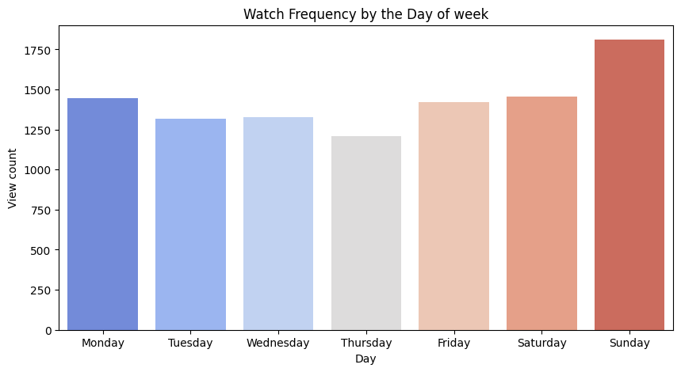

# 🎬 Netflix Watch Time Analysis

This is a personal data analysis project using my Netflix viewing history.  
I extracted viewing patterns based on time, date, and content — and visualized them using Python libraries like Pandas, Matplotlib, and Seaborn.

## 🧠 What I Did
- Cleaned and transformed raw Netflix CSV data
- Extracted features: date, hour, weekday, month, year
- Visualized:
  - Top 10 watched titles
  - Daily viewing trend
  - Viewing patterns by hour & day
  - Heatmap of binge habits

## 🔧 Tools Used
- Python
- Pandas
- Seaborn & Matplotlib
- Google Colab
- GitHub

## 📊 Preview

## 🤓 Author
**Ritesh Manandhar**  
Budding Data Analyst | Aspiring Data Scientist  
[GitHub](https://github.com/mr.Badbytebat) | [LinkedIn]((https://www.linkedin.com/in/ritesh-bytegenosis/))
